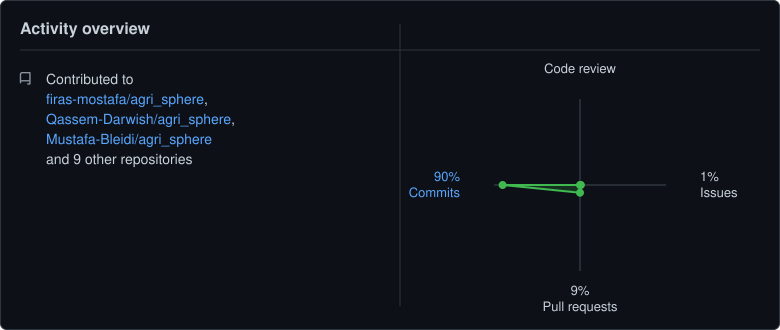

# Mustafa Bleidi

### AI & Machine Learning Engineer

*Applied machine learning and information retrieval, with a React frontend and UI/UX design background.*

  

 

## About

I work across the full stack of applied AI products — from retrieval and NLP pipelines (TF‑IDF/BM25 baselines, semantic embeddings, RAG) and the deep learning models behind them (PyTorch, BERT‑based architectures), to the React/Tailwind frontends and Python backends (Flask, FastAPI) that ship them, deployed with Docker on Linux, and designed with a UI/UX‑first eye from wireframe to interface.

 

<table align="center" width="90%">
<tr>
<td width="50%" valign="top">

**💻 Core Focus**
Applied ML & Information Retrieval, RAG / LLM Systems, and React-based Frontend Development

**🧠 Currently Exploring**
Retrieval-Augmented Generation (RAG), Model Deployment & MLOps, and scalable system architecture

</td>
<td width="50%" valign="top">

**👨‍💼 Experience**
Former Project Lead Intern @ GirlScript Foundation — led delivery on an open-source initiative

**🤝 Open To**
UI/UX audits, open-source contributions, and applied ML / RAG collaborations

</td>
</tr>
</table>

 

## Tech Stack

<table align="center">
<tr>
<td align="center" valign="top" width="33%">

**Frontend & Design**

 

</td>
<td align="center" valign="top" width="33%">

**Machine Learning & AI**

 
 
 
 

</td>
<td align="center" valign="top" width="33%">

**Backend, Tools & Systems**

 
 
 
 
 
 

</td>
</tr>
</table>

 

## Featured Projects

<table align="center" width="95%">
<tr>
<td width="50%" valign="top">

### 🔬 Biomedical IR System
End-to-end retrieval system over a biomedical corpus — NLTK preprocessing, TF-IDF/BM25 baselines, then semantic retrieval with GloVe & BERT embeddings and RM3 query expansion.

`Python` `NLTK` `BM25` `BERT` `PyTorch`

[View Repo →](https://github.com/Mustafa-Bleidi/CodeToText-IR-System)

</td>
<td width="50%" valign="top">

### 🌱 AgriSphere
An application for farmers that recommends planting windows and diagnoses plant diseases from photos of affected crops.

`Python` `Computer Vision` `Laravel` `Flutter`

[View Repo →](https://github.com/Mustafa-Bleidi/agri_sphere)

</td>
</tr>
<tr>
<td width="50%" valign="top">

### 🐾 PetHaven
A pet adoption and care platform with a built-in assistant — React/Tailwind frontend over a .NET backend, with a Rasa conversational agent and Whisper speech transcription.

`React` `.NET` `Rasa` `LangChain` `OpenAI`

🔒 Private — commercial project

</td>
<td width="50%" valign="top">

### 🤖 TradingAgents
A multi-agent LLM framework for financial trading that I study and experiment with to understand agent roles, tool calls, and evaluation.

`Python` `LLM Agents` `RAG`

[View Repo →](https://github.com/Mustafa-Bleidi/TradingAgents)

</td>
</tr>
</table>

 

## Contact

&nbsp;&nbsp;
&nbsp;&nbsp;

  

&nbsp;&nbsp;

 

 

💼 Available for freelance opportunities and full-time positions.

 

## Activity Overview

